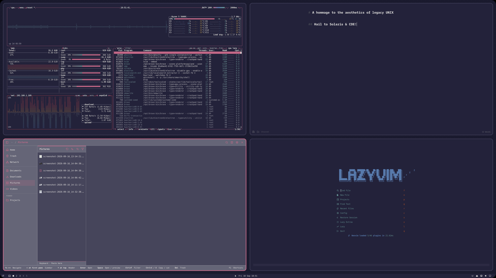

# Solstice — Nightwatch

The **dark** companion to [Solstice Daylight](https://github.com/circumspace/omarchy-solstice-daylight-theme):
a Solaris CDE-inspired Omarchy theme rendered in violet-black with purple chrome
and a brighter rose accent, after the modern **NsCDE** dark look.

## Preview



## Install

```bash
omarchy theme install https://github.com/circumspace/omarchy-solstice-nightwatch-theme
```

Then select **Solstice Nightwatch** from the Omarchy theme picker.

Or manually:

```bash
git clone https://github.com/circumspace/omarchy-solstice-nightwatch-theme \
  ~/.config/omarchy/themes/solstice-nightwatch
```

## Palette

| Role | Hex |
|------|-----|
| Canvas (terminal, docs) | `#1A1A2E` |
| Chrome (panels, bars) | `#2D2B44` |
| Surface (window bodies) | `#23223A` |
| Rose (selection, active) | `#C96A8A` |
| Ink (foreground) | `#EDEBE7` |

Terminal greens are deliberately rose-purple (`#6A5A6A` / `#9A7A9A`) rather than
CDE sage, keeping the whole palette within the violet/rose family.
Full 16-color ANSI palette in [`palette.txt`](palette.txt).

## What's themed

- **Hyprland** — bright rose active border (`#C96A8A`), purple inactive border.
- **GTK 3 / GTK 4** — chrome + rose selection overrides; sharp CDE corners.
  GTK loads user CSS once at startup, so **restart** GTK apps after switching
  *into or out of* this theme for colors to take.
- **Terminal** — Ghostty / Alacritty / Kitty / foot palettes from `colors.toml`.
- **Browser chrome** — `chromium.theme` tints Brave/Chromium/Edge frame color;
  dark tones carry Chromium's MD3 generation cleanly.
- **Neovim** — self-contained `neovim.lua` colorscheme (no plugin dependency).
- **btop, Zed/VS Code, Obsidian, Helix** — generated from `colors.toml`.

## Wallpapers

Five procedurally-generated backdrops in `backgrounds/` (6K), rendered from
[NsCDE](https://github.com/NsCDE/NsCDE) XPM tile patterns recolored to this
palette: **Solyaris, Dimple, Dune, Swirl, Squares**.

## Provenance & credits

- Source screenshots: NsCDE dark desktop captures (see [`palette.txt`](palette.txt)).
- NsCDE: https://github.com/NsCDE/NsCDE

## Related

- **[Solstice Daylight](https://github.com/circumspace/omarchy-solstice-daylight-theme)** — the light variant.

## License

MIT — see [LICENSE](LICENSE).